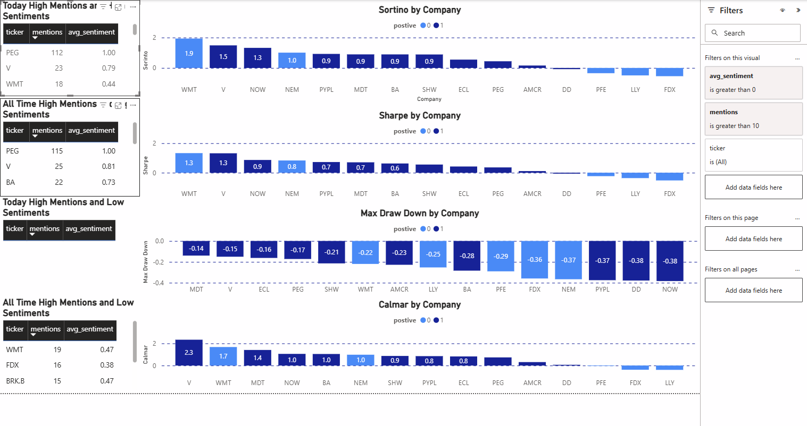

# Sentiment Yahoo News Project

## Overview
This project scrapes news articles from Yahoo Finance for a given day and performs sentiment analysis on them. The focus is on identifying how often companies from the Dow Jones Industrial Average, Nasdaq-100, and S&P 500 are mentioned, and determining the overall sentiment surrounding those mentions. A few financal metrics are applied and then shown on PowerBI

## Steps symplified
* A containerized PostgreSQL database is used to store scraped and processed data.
* All stock tickers and company names for companies within the Dow Jones Industrial Average, Nasdaq-100, and S&P 500 are scraped.
* Articles from Yahoo Finance news are scraped.
* The articles are parsed for the company names(or ticker) if found the mention count is increased and the sentiment is calculated for the sentience where it was mentioned.
* Metrics such as Sharpe ratio and max drew down are calculated using the top 10 highest and lowest sentiments for the day (which must be above the threshold limit).
* Once all data is ready it is connected to PowerBI to create a simple dashboard.

## Issues
As of now the scraper seems to be reading some tickers or company names and is overcounting for companies like Public Service Enterprise Group Inc(PEG) as well as Agilent Technologies(A). It seems to be working fine with all other companies for now. Public Service Enterprise Group Inc. could be just truly occurring a lot due to it being not a common character string but Agilent Technologies is likely counting capital ever captial a.

## Future Plans
* Try with A fine-tuned sentiment analysis model.
* Pull sentiment for a social media source(ex. Twitter)
* Sort companies into industries to find the sentiments on industries as a whole.
  
## Example DashBoard


## Setup
### Clone the project
```bash
git clone 
cd finace_analysis
```
### Build containers
```bash
docker-compose build
```
### Start containers
```bash
docker-compose up -d
```
### Stop containers (once done running) 
```bash
docker-compose down
```
### Connect to powerBI
1. Open Power BI Desktop
2. Go to Home > Get Data > PostgreSQL database
3. Server: localhost DB: financedb
4. Enter password (whatever is in env file)
5. Connect and create tables
